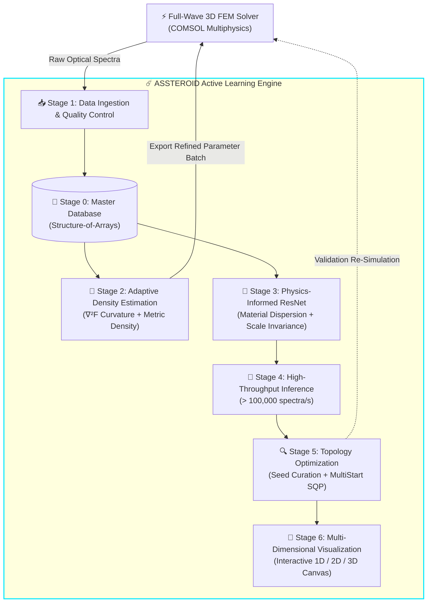
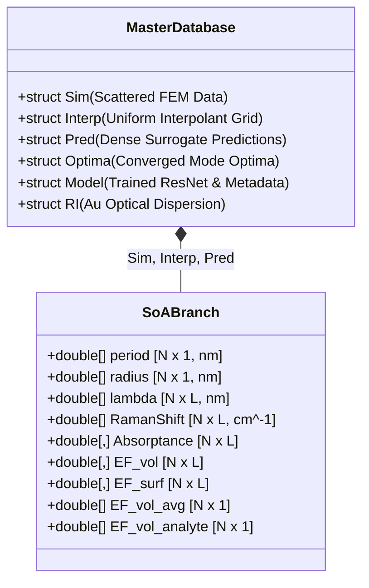

# ☄️ ASSTEROID

**Adaptive Sampling, Surrogate Training, Exploration and Refinement for Optimal Inverse Design**

[](https://www.mathworks.com/products/matlab.html)
[](https://github.com/MahZadYar/ASSTEROID/releases)
[](LICENSE)
[](#citation)
[](#dataset--trained-models)

---

## Overview

**☄️ ASSTEROID** is a closed-loop computational framework engineered for simulation-driven inverse design, high-dimensional surrogate modeling, and multimodal optimization. It couples deep neural network surrogates with automated finite-element method (FEM) parametric sweeps, replacing computationally prohibitive numerical simulations with high-throughput inference ($> 100{,}000$ spectra/s, $> 1.5 \times 10^5 \times$ speedup over full-wave FEM).

While ASSTEROID is demonstrated on the rational geometric design of Nanoparticle-on-Mirror (NPoM) plasmonic gas sensors using rigorous Optical Reciprocity Theorem (ORT) electrodynamics, its modular operational architecture generalizes to any parametric engineering workflow requiring:
1. 💾 **Master Database Management**: Programmatic state tracking, interactive data tree inspection, and metadata archiving.
2. 📥 **Automated Data Ingestion & QA**: Parsing multi-parameter solver outputs into high-performance Structure-of-Arrays (SoA) datasets with electromagnetic passivity verification.
3. 🎯 **Curvature- & Density-Aware Adaptive Sampling**: Directing subsequent simulation batches toward informative, high-enhancement modal regions using 9-point discrete Laplacian curvature operators and dual-tier minimum-distance rejection sampling.
4. 🧠 **Physics-Informed Deep Residual Surrogates**: Training multi-task ResNets featuring explicit material dispersion ($n, k$), geometric scale invariance, and multi-decade $\text{log1p}$ target compression.
5. 🔮 **Dense Landscape Exploration & Spectral Integration**: Ultra-dense sub-nanometer grid inference coupled with Modified Akima piecewise cubic Hermite interpolation (`makima`) for continuous figures of merit.
6. 🔍 **Topology-Aware Multimodal Optimization**: Detecting discrete stationary points ($\nabla F \approx 0$, $\nabla^2 F < 0$), interactive seed curation/tagging, and continuous constrained gradient refinement via `fmincon` (SQP/Interior-Point) using analytical automatic differentiation (`dlgradient`).
7. 🌌 **Multi-Dimensional 3D Visualization & Export**: Rendering 1D spectra, 2D scattered/contour maps, 3D volume slices, and exporting to HDF5, ONNX, and relational MAT tables.

> **Associated Publication:**  
> Maziar Moussavi, Sigitas Tamulevičius, *"Rational Design of Plasmonic Gas Sensors by Optimizing Spectrally-Resolved Volumetric Raman Enhancement Factor"*, 2026. [DOI: 10.1021/acsnano.XXXXXXX (Tentative)](#citation).

---

## Repository Structure

```
ASSTEROID/
│
├── ASSTEROID.m                  ← ☄️ MAIN ENTRY POINT: Unified GUI application launcher
├── start_app.m                  ← Convenience wrapper (delegates to ASSTEROID)
├── setup_project.m              ← Path initialization (run once per session)
│
├── src/                         ← Modular core library
│   ├── app/                     ← Application controllers (v5.0 decoupled MVC) & session state
│   ├── io/                      ← File I/O: sweep table parsers, dispersion loaders, analyte spectra
│   ├── data/                    ← High-performance SoA database engine (~4GB), merge, validate
│   ├── physics/                 ← SERS electrodynamics, ORT metrics, makima spectral integration
│   ├── sampling/                ← Adaptive sampling: Laplacian curvature, density models, rejection
│   ├── modeling/                ← ResNet surrogate architecture, Adam training, fmincon optimization
│   ├── orchestration/           ← Unified Config → Workflow → (Visualize) engine
│   ├── vis/                     ← Visualization: publication heatmaps, Pareto scatters, 3D volshow
│   └── utils/                   ← Column mapping, alias management, unit/matrix helpers
│
├── scripts/                     ← Executable command-line & app entry points
│   ├── apps/                    ← GUI components (HTML5 views, shared design tokens & JS bridge)
│   ├── pipeline/                ← Standalone CLI batch workflows (Stages 1, 3, 4, 5)
│   └── sampling/                ← Standalone adaptive sampling CLI (Stage 2)
│
├── tests/                       ← Automated test suites (run_all_tests.m, 100% passing)
├── docs/                        ← Technical specifications, conventions, and architectural docs
└── legacy/                      ← Archived standalone scripts and prototype utilities
```

---

## The Operational Pipeline & Architecture

The computational framework operates either via the unified interactive application ([`start_app.m`](start_app.m) / [`ASSTEROID.m`](ASSTEROID.m)) or through modular CLI scripts under [`scripts/pipeline/`](scripts/pipeline/) and [`scripts/sampling/`](scripts/sampling/).

### End-to-End Workflow Flowchart

```mermaid
flowchart LR
    subgraph S1 ["📥 Stage 1: Ingestion & QA"]
        Raw["Raw FEM Sweeps<br/>(COMSOL .dat / .csv)"] --> Ingest["readSweepTable<br/>mapHeaders"]
        Ingest --> QA["Passivity Checks &<br/>Footprint Normalization"]
        QA --> SoA[("Master SoA DB<br/>allData.mat")]
    end

    subgraph S2 ["🎯 Stage 2: Adaptive Sampling"]
        SoA --> Curv["9-Pt Laplacian Curvature &nabla;&sup2;F<br/>&amp; Performance Density &rho;"]
        Curv --> Rejection["Dual-Tier Rejection<br/>(d_min &amp; r/P &le; 0.49)"]
        Rejection --> SweepExport["COMSOL Sweep Tables<br/>(New Simulation Batch)"]
        SweepExport -.->|Direct Solver Feed| Raw
    end

    subgraph S3 ["🧠 Stage 3: Surrogate Learning"]
        SoA --> Feat["Physics Feature Engine<br/>8-In / 3-Out (log1p)"]
        Feat --> ResNet["Deep Residual ResNet<br/>Adam + Checkpointing"]
        ResNet --> NetFile[("Trained Model<br/>sers_dnn_model.mat")]
    end

    subgraph S4 ["🔮 Stage 4: Dense Prediction"]
        NetFile --> DenseInference["Dense Grid Inference<br/>&gt; 1.2M Coordinates"]
        DenseInference --> Quad["makima Splines &<br/>Raman Quadrature"]
        Quad --> Efficacies["7 Continuous Optical<br/>Efficacy Landscapes"]
    end

    subgraph S5 ["🔍 Stage 5: Multimodal Optimization"]
        Efficacies --> PeakFinder["Topological Extrema Filter<br/>(&nabla;F &asymp; 0, &nabla;&sup2;F &lt; 0)"]
        PeakFinder --> Curation["Interactive Seed Curation<br/>&amp; Semantic Modal Tagging"]
        Curation --> MultiStart["MultiStart fmincon (SQP)<br/>Analytical dlgradient"]
        MultiStart --> OptimaFile[("maximaResults.mat<br/>Optimal Geometries")]
    end

    subgraph S6 ["🌌 Stage 6: 3D Visualization"]
        OptimaFile --> VisEngine["1D Spectra | 2D Maps | 3D Volumes<br/>HDF5 / ONNX / Relational MAT"]
    end
```



### Closed-Loop Active Learning Architecture



---

### Detailed Stage Breakdown

#### 💾 Stage 0: Master Database Management
* **GUI Component:** Stage 0 Tab (`scripts/apps/database_tab.html`)
* **Core Utilities:** [`src/data/createDatabaseStruct.m`](src/data/createDatabaseStruct.m), [`src/data/exportDatabaseToHDF5.m`](src/data/exportDatabaseToHDF5.m)
* **Function:** Maintains project metadata, provides interactive tree browsing of hierarchical database branches (`db.Sim`, `db.Interp`, `db.Pred`, `db.Optima`, `db.Model`), tracks dirty/unsaved states, and handles robust saving/loading.

#### 📥 Stage 1: Data Ingestion & Quality Control
* **CLI Entry Point:** [`scripts/pipeline/run_import_prl_sweep.m`](scripts/pipeline/run_import_prl_sweep.m)
* **Core Orchestrator:** [`src/orchestration/runImportSweepWorkflow.m`](src/orchestration/runImportSweepWorkflow.m)
* **Function:** Ingests raw full-wave FEM parametric sweep exports (`.dat`/`.csv`), normalizes headers across solver versions, validates electromagnetic passivity ($0 \leq A \leq 1$), compensates for varying unit-cell footprints ($A_{\text{cell}} = \frac{\sqrt{3}}{2}P^2$), and merges records into the canonical Structure-of-Arrays database.

#### 🎯 Stage 2: Adaptive Exploration & Rejection Sampling
* **CLI Entry Point:** [`scripts/sampling/run_AdaptiveParameterSampling.m`](scripts/sampling/run_AdaptiveParameterSampling.m)
* **Core Orchestrator:** [`src/orchestration/runAdaptiveSamplingWorkflow.m`](src/orchestration/runAdaptiveSamplingWorkflow.m)
* **Function:** Identifies undersampled or highly dynamic regions by evaluating discrete 9-point Laplacian curvatures ($\nabla^2 F$) and metric scores. Enforces physical interparticle gap limits ($r/P \leq 0.49$) and dual-tier minimum Euclidean distance separation ($d_{\min}$), generating focused coordinate tables formatted directly for COMSOL batch execution.

#### 🧠 Stage 3: Physics-Informed Deep Surrogate Training
* **CLI Entry Point:** [`scripts/pipeline/run_dnn_pipeline.m`](scripts/pipeline/run_dnn_pipeline.m)
* **Core Orchestrator:** [`src/orchestration/runTrainingWorkflow.m`](src/orchestration/runTrainingWorkflow.m)
* **Function:** Trains an 8-input, 3-head residual neural network (ResNet) mapping geometric scale ($\log P, \log r, \log \lambda$), complex experimental gold dispersion ($n(\lambda), k(\lambda)$), and electrodynamic ratios ($P/\lambda, r/\lambda, P/r$) to optical absorbance ($A$), cell-normalized volume enhancement ($\text{EF}_V^{\text{cell}}$), and surface enhancement ($\text{EF}_S^{\text{cell}}$). Employs multi-decade $\text{log1p}$ target compression, GELU activations, batch normalization, and Adam optimization with automated checkpointing.

#### 🔮 Stage 4: Dense Landscape Prediction & Spectral Efficacy
* **CLI Entry Point:** [`scripts/pipeline/run_prediction_vis.m`](scripts/pipeline/run_prediction_vis.m)
* **Core Orchestrator:** [`src/orchestration/runPredictionVisWorkflow.m`](src/orchestration/runPredictionVisWorkflow.m)
* **Function:** Evaluates the surrogate across an ultra-dense continuous grid ($> 1.2 \times 10^6$ nodes at $\Delta P = \Delta r = 0.7 \, \text{nm}$). Reconstructs high-resolution continuous Stokes spectra ($100$--$3600 \, \text{cm}^{-1}$) via Modified Akima Hermite splines (`makima`) and evaluates all single-frequency and spectrally integrated optical efficacy landscapes.

#### 🔍 Stage 5: Topology-Aware Multimodal Optimization & Seed Curation
* **CLI Entry Point:** [`scripts/pipeline/run_locate_maxima.m`](scripts/pipeline/run_locate_maxima.m)
* **Core Orchestrator:** [`src/orchestration/runLocalizationWorkflow.m`](src/orchestration/runLocalizationWorkflow.m)
* **Function:** Extracts all distinct resonant mode maxima (rather than a single global peak) through 8-connected local peak detection, gradient percentile filtering ($\nabla F \approx 0$), and negative-definite Laplacian concavity checks. Seeds localized MultiStart constrained optimization (`fmincon` with SQP/Interior-Point) driven by analytical neural graph gradients (`dlgradient`), permanently archiving optimal parameters, convergence trajectories, and modal tags.

#### 🌌 Stage 6: Multi-Dimensional 3D Visualization & Export
* **GUI Component:** Stage 6 Tab (`scripts/apps/visualize_tab.html`)
* **Core Rendering:** [`src/vis/buildSpectralVolume.m`](src/vis/buildSpectralVolume.m), [`src/vis/renderAnnotatedVolume.m`](src/vis/renderAnnotatedVolume.m)
* **Function:** Renders synchronized 1D spectra, interactive 2D scattered/interpolated maps, and 3D volumetric slices with local maxima overlays. Exports figures, tabular CSVs, ONNX models, and full HDF5 databases.

---

## Data Model & Metric Reference

### Canonical Metrics
ASSTEROID operates across seven fundamental optical figures of merit evaluated at the laser line ($\lambda_L = 785 \, \text{nm}$) and integrated across the Stokes Raman shift band:

| Metric Symbol | Code Identifier | Description | Physical Focus |
|:---|:---|:---|:---|
| $A_L$ | `Absorptance` (at $\lambda_L$) | Far-field optical absorbance | Energy dissipation & coupling |
| $\text{EF}_{S, \text{approx}}^{\text{cell}}$ | `EF_surf` (at $\lambda_L$) | Cell-normalized surface proxy ($E^4$ proxy) | Surface loading at laser line |
| $\text{EF}_{V, \text{approx}}^{\text{cell}}$ | `EF_vol` (at $\lambda_L$) | Cell-normalized volume proxy ($E^4$ proxy) | Volumetric loading at laser line |
| $\eta_S^{\text{broad}}$ | `EF_surf_avg` | Broadband surface enhancement efficacy | Surface enhancement across Raman band |
| $\eta_V^{\text{broad}}$ | `EF_vol_avg` | Broadband volumetric enhancement efficacy | Volume enhancement across Raman band |
| $\eta_S^{\text{analyte}}$ | `EF_surf_analyte` | Analyte-weighted surface efficacy | Surface overlap with molecular Raman fingerprint |
| $\eta_V^{\text{analyte}}$ | `EF_vol_analyte` | Analyte-weighted volumetric efficacy | Volume overlap with molecular Raman fingerprint |

### Structure-of-Arrays (SoA) Format
All dataset MAT files (`allData.mat`, `prl_sweep_*.mat`) store variables in a memory-aligned SoA layout:
* **Geometry Vectors:** `period` ($N \times 1$ in nm), `radius` ($N \times 1$ in nm)
* **Spectral Coordinates:** `lambda` ($N \times L$ in nm), `f` ($N \times L$ in Hz), `RamanShift` ($N \times L$ in $\text{cm}^{-1}$)
* **Full Spectral Responses:** `Absorptance`, `EF_vol`, `EF_surf` ($N \times L$ numeric matrices)
* **Integrated Scalars:** `EF_vol_avg`, `EF_surf_avg`, `EF_vol_analyte`, `EF_surf_analyte` ($N \times 1$)



---

## Getting Started

### Prerequisites
* **MATLAB**: R2023b or later (validated on R2024a and R2026a).
* **Required Toolboxes:**
  * Deep Learning Toolbox (`dlnetwork`, `dlgradient`, GPU acceleration)
  * Optimization Toolbox (`fmincon`, `MultiStart`)
  * Statistics and Machine Learning Toolbox (`scatteredInterpolant`, Latin hypercube routines)
  * Parallel Computing Toolbox (optional, for multi-threaded batch operations)
  * Image Processing Toolbox (optional, for volumetric rendering via `volshow`)
* **Hardware:** Modern x86-64 / ARM64 workstation. NVIDIA GPU (CUDA compute capability $\geq 3.5$) recommended for deep surrogate training and dense evaluations.

### Installation & Initialization

1. **Clone the Repository:**
   ```bash
   git clone https://github.com/MahZadYar/ASSTEROID.git
   cd ASSTEROID
   ```

2. **Initialize MATLAB Search Path:**
   Launch MATLAB and run:
   ```matlab
   setup_project
   ```
   This automatically adds all functional packages (`src/`, `scripts/`, `tests/`) to your session path.

---

## Usage

### Option 1: Interactive Graphical Application (Recommended)

Launch the unified 5-stage UI from the MATLAB command window:
```matlab
% Launch via the canonical entry point:
ASSTEROID

% Or using the convenience script:
start_app

% Optionally specify a custom working project directory:
ASSTEROID("path/to/my/project/data")
```

The application provides:
* Embedded HTML5 control panels with live parameter validation
* Interactive 2D contour and 3D volume visualization canvases
* Real-time training loss curves, automated checkpointing, and early-stopping diagnostics
* Interactive candidate seed selection, manual coordinate editing, and semantic modal tagging canvas
* Trajectory tracking for localized MultiStart gradient refinement (`fmincon` with SQP / Interior-Point)

### Interactive Multimodal Seed Curation & Optimization Workflow
The optimization canvas (Stage 5) provides a robust 4-step interactive cycle:
1. **Preview Landscape**: Evaluates the surrogate across an ultra-dense $(P, r)$ grid for any canonical metric ($A_L, \text{EF}_V^{\text{cell}}, \text{EF}_S^{\text{cell}}, \eta_V^{\text{broad}}, \eta_V^{\text{analyte}}$).
2. **Topological Seed Detection**: Automatically identifies discrete candidate stationary points ($\nabla F \approx 0, \nabla^2 F < 0$) using 8-connected local extrema filtering and non-maximum suppression.
3. **Manual Curation & Semantic Tagging**: Researchers can prune boundary artifacts, adjust coordinates directly in the reactive table, and assign physical modal tags (*Mode I*, *Mode II+*, *SLR Dipole*).
4. **Continuous Refinement**: Dispatches MultiStart constrained optimization (`fmincon` with analytical `dlgradient`) from curated seeds, preserving custom tags and saving full convergence histories (`IterPath`) to `maximaResults.mat`.

### Option 2: Scriptable CLI Batch Pipeline

Each stage can be executed independently from MATLAB scripts. Each script contains a self-documenting configuration block at the top:

```matlab
% 1. Ingest raw COMSOL simulation sweep
run("scripts/pipeline/run_import_prl_sweep.m")

% 2. Synthesize adaptive sampling points for next simulation batch
run("scripts/sampling/run_AdaptiveParameterSampling.m")

% 3. Train physics-informed deep residual surrogate (with auto-checkpointing)
run("scripts/pipeline/run_dnn_pipeline.m")

% 4. Generate dense grid predictions & render efficacy landscapes
run("scripts/pipeline/run_prediction_vis.m")

% 5. Execute topology-aware multi-modal maxima localization
run("scripts/pipeline/run_locate_maxima.m")
```

---

## Documentation

Comprehensive architectural specifications, mathematical formalisms, and user manuals are located in [`docs/`](docs/):
* [Application Architecture](docs/app_architecture.md): Complete architecture of the unified app, state machines, and JavaScript-MATLAB bridge.
* [Optimization & Seed Curation Guide](docs/optimization_workflow_guide.md): Multimodal peak extraction, interactive seed curation, tag preservation, and MultiStart SQP refinement.
* [Feature Preprocessing System](docs/feature_preprocessing_system.md): Mathematical formulations for geometric scale invariance, dispersion lookup, and logarithmic compression.
* [Orchestration Patterns](docs/orchestration_patterns.md): Unified Config → Workflow → ProgressReporter execution patterns.
* [Paper to Code Reference](docs/paper_to_code_reference.md): Detailed cross-reference linking formulas in the publication to source functions.
* [Physical & Mathematical Notation](docs/notation_table.md): Parameter symbol glossary and dimensional units.
* [Surrogate Checkpoint Guide](docs/checkpoint_guide.md): Checkpointing, training interruption handling, and fine-tuning procedures.

---

## Testing & Verification

Comprehensive test suites are located in [`tests/`](tests/). Run all tests to verify your installation:

```matlab
setup_project

% Run complete automated test suite (19 suites, 100% coverage):
summary = run_all_tests();
disp(summary)

% Or run specific diagnostic tests individually:
run("tests/test_soa_conversion.m")          % SoA conversion and grid reshaping
run("tests/test_unit_conversion.m")         % Dimensional unit consistency
run("tests/test_interp_column_order.m")     % Spectral column alignment verification
run("tests/test_defaults.m")                % Built-in dispersion and analyte checks
run("tests/test_surrogate_v2.m")            % ResNet architecture, log1p targets, AD gradients
```

---

## Dataset & Trained Models

Curated simulation datasets, trained ResNet surrogate checkpoints, and COMSOL multiphysics models are archived on Zenodo:
* **Zenodo Repository:** [https://doi.org/10.5281/zenodo.XXXXXXX](https://doi.org/10.5281/zenodo.XXXXXXX) (Tentative)
  * `allData.mat`: Master Structure-of-Arrays dataset containing 3,500 validated NPoM geometries across 20 wavelengths ($\approx 70{,}000$ points).
  * `sers_dnn_model_sphere_785_new.mat`: Pre-trained ResNet surrogate model.
  * `McPeak.csv`: Experimental spectroscopic ellipsometry dispersion data for Au.

---

## Citation

If you use ASSTEROID or its surrogate-assisted inverse design methodology in your research, please cite:

```bibtex
@article{Moussavi2026_RationalDesign,
  author    = {Moussavi, Maziar and Tamulevi{\v{c}}ius, Sigitas},
  title     = {Rational Design of Plasmonic Gas Sensors by Optimizing Spectrally-Resolved Volumetric Raman Enhancement Factor},
  journal   = {ACS Nano},
  year      = {2026},
  volume    = {XX},
  number    = {X},
  pages     = {XXXX--XXXX},
  doi       = {10.1021/acsnano.XXXXXXX}
}
```

---

## License & Acknowledgments

This research is supported by the **NanoTRAACES** project at the Institute of Materials Science, Kaunas University of Technology.

For licensing, commercial inquiries, or academic collaboration, please contact:
* **Maziar Moussavi**: [maziar.moussavi@ktu.lt](mailto:maziar.moussavi@ktu.lt)
* **Prof. Sigitas Tamulevičius**: [sigitas.tamulevicius@ktu.lt](mailto:sigitas.tamulevicius@ktu.lt)
