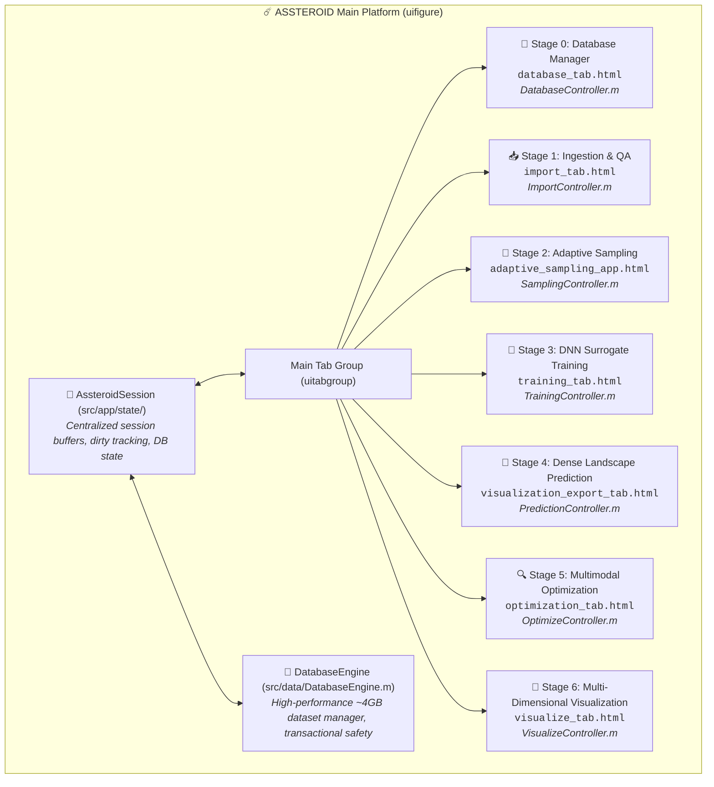
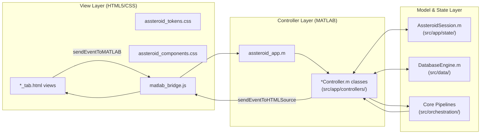
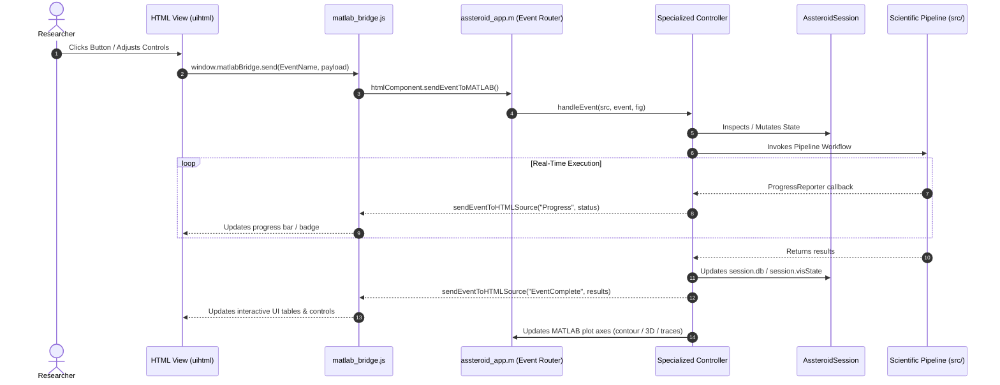

# ☄️ ASSTEROID App Architecture & Integration (Version 5.0)

**Scope:** Decoupled MVC controller architecture, session state management, shared HTML5 design token system, and MATLAB backend coupling  
**Audience:** Developers maintaining or extending the computational platform  
**Implementation:** [`scripts/apps/assteroid_app.m`](../scripts/apps/assteroid_app.m) (launched via [`ASSTEROID.m`](../ASSTEROID.m) or [`start_app.m`](../start_app.m))  
**Controller Layer:** [`src/app/controllers/`](../src/app/controllers/) | **Session State:** [`src/app/state/`](../src/app/state/) | **Database Engine:** [`src/data/DatabaseEngine.m`](../src/data/DatabaseEngine.m)

---

## 1. Quick Start for Developers

### App Entry Points
```matlab
ASSTEROID             % Canonical launcher: initializes paths and launches assteroid_app
start_app             % Convenience alias (delegates to ASSTEROID)
assteroid_app         % Direct app figure constructor
```

### Full 7-Stage Architectural Hierarchy



Each stage integrates:
- **HTML5/CSS3 View (`uihtml`)** ([`scripts/apps/*_tab.html`](../scripts/apps/)) — Responsive UI styled with shared design tokens
- **Specialized MATLAB Controller** ([`src/app/controllers/*Controller.m`](../src/app/controllers/)) — Decoupled event router and workflow coordinator
- **MATLAB Visualizer Panel** — High-performance 2D contour, training convergence, or 3D volumetric axes
- **Bidirectional Event Bridge** ([`scripts/apps/shared/js/matlab_bridge.js`](../scripts/apps/shared/js/matlab_bridge.js)) — Robust event dispatching and contract serialization

---

## 2. Decoupled MVC Controller Architecture

Version 5.0 enforces a strict Model-View-Controller (MVC) separation:



### Central Session State: `AssteroidSession`
**Location:** [`src/app/state/AssteroidSession.m`](../src/app/state/AssteroidSession.m)

```matlab
session = AssteroidSession(workFolder);
% Manages:
%   session.workDir         - Active workspace directory
%   session.db              - Current in-memory Structure-of-Arrays (SoA) database
%   session.dbFile          - Absolute path to active .mat database
%   session.dbDirty         - Boolean unsaved-changes indicator
%   session.visState        - Visualization and grid inference cache
%   session.process         - Running workflow state, background job handles
%   session.broadcastDbStatus() - Cross-stage reactive event broadcaster
```

### High-Performance Master Database Engine: `DatabaseEngine`
**Location:** [`src/data/DatabaseEngine.m`](../src/data/DatabaseEngine.m)

Designed to handle large databases scaling to **~4GB** without memory leaks or UI latency:
- **Chunked In-Place Loading:** Validates SoA headers before deep loading, avoiding redundant copies of massive 2D spectral arrays (`[N_geom × 406]`).
- **Transactional Writes:** Saves to temporary shadow files (`*.mat.tmp`) before atomic rename, preventing database corruption if a save is interrupted.
- **Dirty-State Auditing:** Tracks state mutations; automatically signals Stage 0 and status banners across tabs when data has unsaved changes.
- **Log Notifications:** Dispatches event notifications and console logs when multi-gigabyte operations commence and conclude.

---

## 3. Cosmic Design Tokens & Shared Component System

Visual styling across all 7 HTML views and MATLAB figure axes is governed by a unified atomic token hierarchy derived from [`docs/Pallette.svg`](Pallette.svg):

### The Four Spectral Color Families

| Family | Role | Primary Key (Middle Column) | Tonal Variants |
|:---|:---|:---|:---|
| **Row A (Cobalt Blue)** | Backgrounds, Structural Borders, Info | **`A40` (`#241ec3`)** | `A10` (`#000117`) to `A90` (`#d1ddff`) |
| **Row B (Electric Violet)** | Deep Neural Surrogates & AI Models | **`B50` (`#7f00e0`)** | `B10` (`#060011`) to `B95` (`#f1ebff`) |
| **Row C (SERS Teal)** | Primary Brand Accent, SERS Enhancements | **`C60` (`#27928d`) / `C70` (`#48b2ac`)** | `C12` (`#000808`) to `C98` (`#e4fffc`) |
| **Row D (Luminous Gold)** | Optima Maxima, Resonant Hotspots, Warnings | **`D70` (`#c9942c`) / `D80` (`#ebb34f`)** | `D15` (`#110a00`) to `D98` (`#fff8eb`) |
| **Row G (Neutrals)** | Contrast Hierarchy & Typography | `G10` (`#030303`) to `G98` (`#f8f8f8`) | `G10`–`G40` surfaces; `G50`–`G98` text |

### Continuous Colormap Alignment
The continuous colormap used in 2D/3D surface plots ([`src/vis/AuroraAustralis.txt`](../src/vis/AuroraAustralis.txt)) directly interpolates the 12 key stops of the `Pallette.svg` spectral gradient, bridging qualitative UI tokens and physical field representations.

### Shared CSS & JavaScript Resources
- [`scripts/apps/shared/css/assteroid_tokens.css`](../scripts/apps/shared/css/assteroid_tokens.css): Atomic tokens (`--pal-*`) and semantic roles (`--bg-primary: #060812;`, `--bg-secondary: #0c1020;`, `--accent: #48b2ac;`, `--border: #162038;`).
- [`scripts/apps/shared/css/assteroid_components.css`](../scripts/apps/shared/css/assteroid_components.css): Unified buttons (`.btn-primary`, `.btn-purple`, `.btn-gold`), status badges, progress bars, cards, and custom scrollbars.
- [`scripts/apps/shared/js/matlab_bridge.js`](../scripts/apps/shared/js/matlab_bridge.js): Unified bi-directional communication layer providing `window.matlabBridge.send()`, `on()`, and progress reporting.

---

## 4. Stage-by-Stage Implementation Reference

### Stage 0: Master Database Manager
- **HTML View:** [`scripts/apps/database_tab.html`](../scripts/apps/database_tab.html)
- **Controller:** [`src/app/controllers/DatabaseController.m`](../src/app/controllers/DatabaseController.m)
- **Features:** Hierarchical dataset browser, schema compliance check, dirty status indicator, in-place reload, backup creation, and database statistics inspector.
- **Key Events:** `RequestDbStatus`, `LoadDatabase`, `SaveDatabase`, `BackupDatabase`.

### Stage 1: Ingestion & Sweep QA
- **HTML View:** [`scripts/apps/import_tab.html`](../scripts/apps/import_tab.html)
- **Controller:** [`src/app/controllers/ImportController.m`](../src/app/controllers/ImportController.m)
- **Features:** Multi-file COMSOL sweep parsing, electromagnetic passivity check ($0 \leq A \leq 1$), unit normalization, SoA deduplication, and QA plot generation.
- **Key Events:** `ScanDirectory`, `RunImport`, `BrowseImportPath`.

### Stage 2: Adaptive Parameter Sampling
- **HTML View:** [`scripts/apps/adaptive_sampling_app.html`](../scripts/apps/adaptive_sampling_app.html)
- **Controller:** [`src/app/controllers/SamplingController.m`](../src/app/controllers/SamplingController.m)
- **Features:** 9-point Laplacian curvature calculation, dual-tier minimum-distance rejection sampling, failed/unconverged geometry extraction, and COMSOL batch table export.
- **Key Events:** `ComputeDensity`, `GenerateBatch`, `HighlightNanPoints`, `ExportBatch`.

### Stage 3: DNN Surrogate Training
- **HTML View:** [`scripts/apps/training_tab.html`](../scripts/apps/training_tab.html)
- **Controller:** [`src/app/controllers/TrainingController.m`](../src/app/controllers/TrainingController.m)
- **Features:** Physics-informed 8-input ResNet configuration, learning rate schedules (piecewise/cosine), real-time loss curves, LayerNorm monitoring, and checkpoint persistence.
- **Key Events:** `StartTraining`, `StopTraining`, `BrowseCheckpoint`, `SaveModel`.

### Stage 4: Dense Landscape Prediction
- **HTML View:** [`scripts/apps/visualization_export_tab.html`](../scripts/apps/visualization_export_tab.html)
- **Controller:** [`src/app/controllers/PredictionController.m`](../src/app/controllers/PredictionController.m)
- **Features:** Ultra-dense sub-nanometer inference ($> 100{,}000$ spectra/s), Makima interpolation, analyte vibrational weighting, and relational MAT/HDF5 export.
- **Key Events:** `RunDensePrediction`, `LoadAnalyte`, `ExportLandscape`.

### Stage 5: Topology-Aware Multimodal Optimization
- **HTML View:** [`scripts/apps/optimization_tab.html`](../scripts/apps/optimization_tab.html)
- **Controller:** [`src/app/controllers/OptimizeController.m`](../src/app/controllers/OptimizeController.m)
- **Features:** 8-connected discrete stationary point detection, interactive seed curation canvas, modal semantic tagging, localized `fmincon` SQP refinement, and trajectory logging.
- **Key Events:** `DetectSeeds`, `CurateSeeds`, `RunFineTune`, `ExportMaximaResults`.

### Stage 6: Multi-Dimensional Scientific Visualization
- **HTML View:** [`scripts/apps/visualize_tab.html`](../scripts/apps/visualize_tab.html)
- **Controller:** [`src/app/controllers/VisualizeController.m`](../src/app/controllers/VisualizeController.m)
- **Features:** Synchronized 1D spectra plots, 2D response heatmaps, and interactive 3D volumetric slicing via MATLAB `viewer3d` with the `AuroraAustralis` colormap.
- **Key Events:** `SelectGeometry`, `ChangeMetric`, `SliceVolume3D`.

---

## 5. Event Flow: HTML ↔ MATLAB



---

## 6. Testing & Validation

All controllers, database operations, and workflows are validated via the automated test suite runner:
```matlab
setup_project;
summary = run_all_tests();
```
- **Total Test Suites:** 31
- **Current Pass Rate:** 100% (31/31 passing)
- **Dedicated Controller Tests:**
  - `tests/test_database_controller.m`
  - `tests/test_database_engine.m`
  - `tests/test_import_controller.m`
  - `tests/test_sampling_controller.m`
  - `tests/test_training_controller.m`
  - `tests/test_prediction_controller.m`
  - `tests/test_optimize_controller.m`
  - `tests/test_visualize_controller.m`
