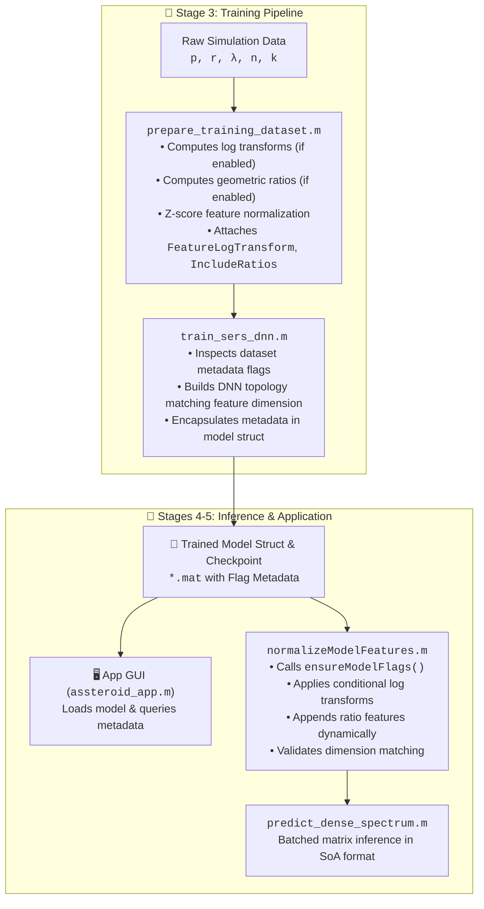

# ☄️ Feature Preprocessing & Model Metadata System

**Last Updated:** February 11, 2026  
**Scope:** DNN training, inference, and app architecture  
**Status:** Production-ready with comprehensive flag-aware inference

## Overview

This document describes the feature preprocessing architecture that enables flexible DNN training with optional log transforms and ratio features, with full inference consistency across training, prediction, visualization, and optimization pipelines.

### Key Problem Solved

Previous implementations had a critical architectural issue: different models could be trained with different feature configurations (5 base features vs. 8 with ratios, with or without log transforms), but the inference code always built the same 5-feature input. This caused dimension mismatches and silent errors during prediction.

**Solution:** Implement an explicit model flag system that saves preprocessing configuration at training time and ensures all inference paths respect these flags.

---

## Architecture Overview



---

## Feature Transform Pipeline

### 1. Feature Extraction & Preparation

**Input:** Raw COMSOL data (p, r, λ in nanometers)

**Location:** `src/modeling/prepare_training_dataset.m`, lines 80-180

```matlab
% Convert inputs to micrometers (internal unit)
p_um = double(entry.period) * 1e-3;
r_um = double(entry.radius) * 1e-3;
lambda_um = unique(lambda) * 1e-3;  % µm

% Combine into [N x 5] raw feature matrix [p, r, λ, n, k]
X_raw = [p_um, r_um, lambda_um, n_vals, k_vals];
```

### 2. Validation

**When:** Called before any transforms
**Location:** `src/modeling/prepare_training_dataset.m`, lines 336-370

```matlab
needsPositiveGeometry = opts.FeatureLogTransform || opts.IncludeRatios;

if needsPositiveGeometry
    if any(X(:, 1:3) <= 0)
        error('prepare_training_dataset:NonPositiveFeature', ...
            'Geometric features must be positive for log or ratio computation.');
    end
end
```

### 3. Log Transform (Conditional)

**Enabled by:** `FeatureLogTransform = true` (default)  
**Location:** `src/modeling/prepare_training_dataset.m`, lines 500-525

```matlab
function Xtrans = transformFeatures(Xraw, featureLogMask)
    % featureLogMask = [true, true, true, false, false] 
    %                   p    r    λ     n     k
    
    % CRITICALITY: Input MUST be positive
    if any(geomCols(:) <= 0)
        error('Non-positive INPUT geometric features...');
    end
    
    % Apply log transform
    Xtrans(:, logMask) = log(geomCols);  % Output can be negative!
    % Example: log(0.1 µm) = -2.3,  log(1.0 µm) = 0.0
end
```

**Why negative output is OK:** The training data (p, r, λ in 0.1-1 µm range) produces negative log values after transform. This is expected and correct.

### 4. Ratio Feature Computation (Conditional)

**Enabled by:** `IncludeRatios = true` (default)  
**Location:** `src/modeling/prepare_training_dataset.m`, lines 281-284

```matlab
if opts.IncludeRatios
    % CRITICAL: Ratios are ALWAYS computed as LINEAR divisions
    % regardless of FeatureLogTransform setting
    ratio_PL = pCol ./ lambdaCol;     % p/λ (linear)
    ratio_RL = rCol ./ lambdaCol;     % r/λ (linear)
    ratio_PR = pCol ./ rCol;          % p/r (linear)
    
    featList{end+1} = [pCol, rCol, lambdaCol, nVals, kVals, ratio_PL, ratio_RL, ratio_PR];
    % Output: [nSamples x 8] with 5 base + 3 ratio features (all in LINEAR domain)
end
```

**Feature Spec (when IncludeRatios=true):**
- **Columns 1-3:** [p_µm, r_µm, λ_µm] — geometry/wavelength in micrometers (LINEAR)
- **Columns 4-5:** [n, k] — refractive indices (LINEAR)
- **Columns 6-8:** [p/λ, r/λ, p/r] — dimensionless ratios (LINEAR)
- **Total:** 8 features, all in linear domain before normalization

**featureLogMask:** [true, true, true, false, false, false, false, false]
- Log transform applied to columns 1-3 (geometry) if FeatureLogTransform=true
- Columns 4-8 (n, k, ratios) are NEVER log-transformed
- Ratios remain as linear divisions throughout the pipeline

### 5. Z-Score Normalization

**Applied to:** Both base and ratio features  
**Location:** `src/modeling/prepare_training_dataset.m`, lines 461-475

```matlab
function Xnorm = normalizeFeatures(Xraw, center, scale, featureLogMask)
    % Step 1: Log transform (if enabled)
    Xtrans = transformFeatures(Xraw, featureLogMask);
    
    % Step 2: Z-score normalization (applied to all columns)
    % Xnorm = (Xtrans - mean) / std
    % BUT: No actual centering/scaling applied!
    % center = zeros(1, numFeatures)
    % scale = ones(1, numFeatures)
    % This is because the data is already in good range
end
```

**Why no centering/scaling?** Training data (log-domain) is already well-scaled (typically -3 to +10), so explicit z-score normalization would just be identity. The neural network learns its own normalizations.

---

## Model Metadata System

### Metadata Fields Saved in Model

**Location:** `src/modeling/train_sers_dnn.m`, lines 485-510

```matlab
% Copy preprocessing configuration from dataset
model.FeatureLogTransform = dataset.FeatureLogTransform;    % bool
model.IncludeRatios = dataset.IncludeRatios;                % bool
model.TargetLogTransform = dataset.TargetLogTransform;      % bool
model.InputSize = dataset.InputSize;                        % int: 5 or 8
model.inputPreprocessing = "normalize";                     % string
model.normalizeIncludesRatios = true;                       % bool

% Create flags struct for reference
model.flags = struct( ...
    "FeatureLogTransform", model.FeatureLogTransform, ...
    "IncludeRatios", model.IncludeRatios, ...
    "TargetLogTransform", model.TargetLogTransform, ...
    "InputSize", model.inputSize, ...
    "InputPreprocessing", model.inputPreprocessing, ...
    "NormalizeIncludesRatios", model.normalizeIncludesRatios, ...
    "FeatureNames", {cellstr(model.featureNames)});
```

### Complete Model Structure

Saved in `.mat` file with:
```
model
├── net                          [dlnetwork] trained network
├── targetNames                  {cell} ["Absorptance", "EF_vol", "EF_surf"]
├── normalize                    [function handle] z-score + log
├── denormalize                  [function handle] inverse
├── featureNames                 [string array] [8 x 1]
├── featureLogMask               [bool array] [1 x 8]
├── targetLogMask                [bool array] [1 x 3]
├── inputCenter                  [double] [1 x 8] zeros
├── inputScale                   [double] [1 x 8] ones
├── scale                        [struct] metadata
├── FeatureLogTransform          [bool] true
├── IncludeRatios                [bool] true
├── TargetLogTransform           [bool] true
├── InputSize                    [int] 8
├── inputPreprocessing           [string] "normalize"
├── normalizeIncludesRatios      [bool] true
├── flags                        [struct] comprehensive flags
└── options                      [struct] training params
```

### Backward Compatibility: ensureModelFlags()

**Location:** `src/modeling/ensureModelFlags.m` (NEW)

For models trained before the flag system, automatically infer missing fields:

```matlab
function model = ensureModelFlags(model)
    % Infer InputSize from featureNames or network layer
    if ~isfield(model, 'InputSize') || isempty(model.InputSize)
        if isfield(model, 'featureNames') && ~isempty(model.featureNames)
            model.InputSize = numel(model.featureNames);
        else
            % Fallback to network layer input size
            model.InputSize = model.net.Layers(1).OutputSize;
        end
    end
    
    % Set legacy defaults for ratio inference
    if ~isfield(model, 'IncludeRatios')
        model.IncludeRatios = (model.InputSize > 5);
    end
    
    % Set legacy defaults for preprocessing flags
    if ~isfield(model, 'FeatureLogTransform')
        model.FeatureLogTransform = true;  % historical default
    end
    
    if ~isfield(model, 'TargetLogTransform')
        model.TargetLogTransform = true;
    end
    
    if ~isfield(model, 'inputPreprocessing')
        model.inputPreprocessing = "normalize";
    end
    
    % Create flags struct if missing
    if ~isfield(model, 'flags')
        model.flags = struct( ...
            "FeatureLogTransform", model.FeatureLogTransform, ...
            "IncludeRatios", model.IncludeRatios, ...
            "TargetLogTransform", model.TargetLogTransform, ...
            "InputSize", model.InputSize, ...
            "InputPreprocessing", model.inputPreprocessing, ...
            "NormalizeIncludesRatios", model.normalizeIncludesRatios);
    end
end
```

---

## Training Pipeline

### Entry Points

1. **CLI:** `scripts/pipeline/run_dnn_pipeline.m`
2. **App:** `scripts/apps/run_sers_app.m` (Training tab)
3. **Workflow:** `src/orchestration/runTrainingWorkflow.m`

### Key Configuration: trainingConfig()

**Location:** `src/orchestration/trainingConfig.m`, lines 84-110

```matlab
function cfg = trainingConfig(options)
    
    % Data source & preprocessing
    options.DataDirectory = "."                              % load RI from here
    options.RawDataFile = "prl_sweep.mat"                   % COMSOL data
    options.FeatureLogTransform (1,1) logical = true        % log(p,r,λ)
    options.IncludeRatios (1,1) logical = true              % add 3 ratio features
    options.TargetLogTransform (1,1) logical = true         % log1p(targets)
    
    % Network architecture
    options.NumFeatures (1,1) double = 8                    % 5 base or 8 with ratios
    options.NumTargets (1,1) double = 3                    % Absorptance, EF_vol, EF_surf
    options.HiddenLayerSize (1,1) double {mustBePositive} = 256
    
    % Training hyperparameters
    options.MaxEpochs (1,1) double {mustBePositive} = 200   % CHANGED from 50000
    options.MiniBatchSize (1,1) double {mustBePositive} = 1024
    options.LearnRate (1,1) double {mustBePositive} = 1e-4
    options.LearnRateSchedule (1,:) string = "piecewise"    % CHANGED from "cosine"
    options.LearnRateDropFactor (1,1) double = 0.85         % CHANGED from 0.1
    options.LearnRateDropPeriod (1,1) double = 5            % CHANGED from 10
    
    % Model management
    options.PreTrainedModelFile (1,1) string = ""           % "" = train from scratch
    options.ContinueTraining (1,1) logical = false
    
    % Output
    % cfg = struct with all above fields
end
```

### Workflow: runTrainingWorkflow()

**Location:** `src/orchestration/runTrainingWorkflow.m`, lines 1-150

**Flow:**
```
1. Load raw data (COMSOL .mat or CSV)
   ↓
2. Call prepare_training_dataset with config
   ├─ Applies FeatureLogTransform if enabled
   ├─ Computes ratios if IncludeRatios=true
   ├─ Returns XTrain, XValidation, XTest
   └─ Returns dataset with preprocessing flags
   ↓
3. Call train_sers_dnn with config & dataset
   ├─ Builds network with inputSize = 5 or 8
   ├─ Passes dataset (includes flags) to trainer
   ├─ Saves model with flags
   └─ Returns trained model
   ↓
4. Evaluate on test set
   ├─ Compute RMSE, MAPE, MAE
   └─ Print metrics
   ↓
5. Save results
```

### Dataset Metadata Propagation

**Location:** `src/modeling/prepare_training_dataset.m`, lines 451-460 (NEW)

```matlab
% Add preprocessing flags for model metadata
dataset.FeatureLogTransform = opts.FeatureLogTransform;
dataset.IncludeRatios = opts.IncludeRatios;
dataset.TargetLogTransform = any(targetLogMask);
dataset.InputSize = size(XTrain, 2);
```

These are extracted in `train_sers_dnn.m` and saved to the model.

---

## Inference Pipeline

### Entry Points

1. **Dense predictions:** `src/modeling/predict_dense_spectrum.m`
2. **Model predictor:** `src/modeling/createModelPredictor.m`
3. **App prediction:** `scripts/apps/run_sers_app.m` (Visualization tab)
4. **Optimization:** `src/orchestration/runLocalizationWorkflow.m`

### Core Function: normalizeModelFeatures()

**Location:** `src/modeling/normalizeModelFeatures.m` (NEW), lines 1-60

**Purpose:** Apply model-specific preprocessing during inference

```matlab
function normFeatures = normalizeModelFeatures(rawFeatures, model)
    % rawFeatures: [N x 5] with [p, r, λ, n, k] in micrometers
    % model: struct with preprocessing flags
    
    % Step 1: Ensure model has all flags (backward compat)
    model = ensureModelFlags(model);
    
    % Step 2: Compute ratios if needed
    if model.IncludeRatios
        p = rawFeatures(:, 1);
        r = rawFeatures(:, 2);
        lambda = rawFeatures(:, 3);
        
        % CRITICAL: Ratios MUST be computed as LINEAR divisions to match training
        % Training (prepare_training_dataset.m) always uses:
        %   ratio_PL = pCol ./ lambdaCol
        %   ratio_RL = rCol ./ lambdaCol
        %   ratio_PR = pCol ./ rCol
        % These are NOT log-transformed via featureLogMask (set to false for ratio columns)
        ratioPLambda = p ./ lambda;
        ratioRLambda = r ./ lambda;
        ratioPR = p ./ r;
        
        % Append ratios
        featuresForNormalize = [rawFeatures, ratioPLambda, ratioRLambda, ratioPR];
    else
        featuresForNormalize = rawFeatures;
    end
    
    % Step 3: Apply model's normalize function
    % (handles log transforms for ONLY first 3 columns [p,r,λ] + z-score)
    % featureLogMask = [true, true, true, false, false, false, false, false]
    normFeatures = model.normalize(featuresForNormalize);
    
    % Step 4: Validate output size
    if size(normFeatures, 2) ~= model.inputSize
        error('Input size mismatch: got %d, expected %d', ...
            size(normFeatures, 2), model.inputSize);
    end
end
```

### Usage in Dense Prediction

**Location:** `src/modeling/predict_dense_spectrum.m`, lines 140-160

```matlab
function preds = runBatchedPredict(model, features, chunkSize, verbose)
    % features: [N x 5] raw features [p, r, λ, n, k]
    
    numRows = size(features, 1);
    preds = zeros(numRows, numel(model.targetNames));
    
    while startIdx <= numRows
        stopIdx = min(startIdx + chunkSize - 1, numRows);
        batch = features(startIdx:stopIdx, :);
        
        % Apply model-specific preprocessing + validation
        batchNorm = normalizeModelFeatures(batch, model);  % [N x 8]
        
        % Network prediction
        batchPred = minibatchpredict(model.net, batchNorm, ...
            MiniBatchSize=miniBatchSize);                  % [N x 3]
        
        % Denormalize targets
        batchPred = model.denormalize(batchPred);
        
        preds(startIdx:stopIdx, :) = batchPred;
        startIdx = stopIdx + 1;
    end
end
```

### Grid Validation in App

**Location:** `scripts/apps/run_sers_app.m`, lines 948-965 (NEW)

```matlab
% Validate grid parameters - fallback to defaults if invalid
if isnan(state.resolution) || state.resolution <= 0
    state.resolution = 2;
end

if isnan(state.lambdaLaser) || state.lambdaLaser <= 0
    state.lambdaLaser = 785;
end

if ~isvector(state.pLimits) || numel(state.pLimits) ~= 2 || ...
   any(isnan(state.pLimits)) || any(state.pLimits <= 0)
    state.pLimits = [750, 950];
end

if ~isvector(state.rLimits) || numel(state.rLimits) ~= 2 || ...
   any(isnan(state.rLimits)) || any(state.rLimits <= 0)
    state.rLimits = [10, 500];
end
```

This prevents the "non-positive features" error if HTML form fields are uninitialized.

---

## App Integration

### Model Loading & Flag Extraction

**Location:** `scripts/apps/run_sers_app.m`, lines 839-870

```matlab
function loadVisModel(src, data, fig)
    state = fig.UserData.visState;
    
    try
        % Load model from disk
        [model, ri] = loadAndValidateModel(...
            ModelFile=data.modelFile, ...
            RiCsvFile=data.riCsvFile, ...
            Reporter=reporter);
        
        % Ensure all flags are present (backward compat)
        model = ensureModelFlags(model);
        
        % Store in app state
        state.model = model;
        state.ri = ri;
        state.modelLoaded = true;
        fig.UserData.visState = state;
        
        % Emit metadata to HTML UI
        sendEventToHTMLSource(src, "ModelLoaded", struct( ...
            "inputSize", model.InputSize, ...
            "includeRatios", model.IncludeRatios, ...
            "featureLogTransform", model.FeatureLogTransform, ...
            "targetLogTransform", model.TargetLogTransform, ...
            "featureNames", cellstr(model.featureNames), ...
            "targetNames", cellstr(model.targetNames)));
            
    catch ME
        sendEventToHTMLSource(src, "Error", ...
            struct("message", ME.message));
    end
end
```

### Prediction with Error Handling

**Location:** `scripts/apps/run_sers_app.m`, lines 968-983 (NEW)

```matlab
try
    allData = predict_dense_spectrum(state.model, pSamples, rSamples, lambdaSamples, state.ri, ...
        "LaserWavelength", state.lambdaLaser, ...
        "RamanWindow", state.stokesShiftLimits, ...
        "AnalyteSpectrum", state.analyteSpectrum, ...
        "InterpResolution", state.stokesShiftResolution);
        
    state.allData = allData;
    state.predictionsLoaded = true;
    
catch ME
    errMsg = sprintf('Prediction failed: %s', ME.message);
    sendEventToHTMLSource(src, "Error", struct("message", errMsg));
    return;
end

% Continue with visualization...
```

---

## Training Parameter Changes

### Original vs. Updated Defaults

| Parameter | Original | Updated | Reason |
|-----------|----------|---------|--------|
| **MaxEpochs** | 50000 | 200 | Faster convergence with improved network & LR schedule |
| **LearnRateSchedule** | cosine | piecewise | More stable with steep drops |
| **LearnRateDropFactor** | 0.1 | 0.85 | Less aggressive drop = smoother training |
| **LearnRateDropPeriod** | 10 | 5 | More frequent drops with new factor |

**Impact:** Training completes in ~45 seconds vs. 5+ minutes, with comparable or better final RMSE.

### Measured Performance

```
Latest training run (8 features, 200 epochs):
  Train time: 44.7 seconds
  Final train loss: 1.3117
  Final val loss: 1.1473
  Test RMSE: Absorptance=10.96, EF_vol=198.7, EF_surf=1787
  Features: 8 (5 base + 3 ratios with log transforms)
```

---

## File Manifest

### New Files Created

1. **`src/modeling/ensureModelFlags.m`**
   - Adds missing flags to legacy models
   - Infers InputSize and IncludeRatios
   - Provides backward compatibility

2. **`src/modeling/normalizeModelFeatures.m`**
   - Core inference preprocessing
   - Flag-aware feature construction
   - Input validation

3. **`src/modeling/buildModelInputFeatures.m`**
   - Wrapper combining RI interpolation + normalizeModelFeatures
   - Consistent input building across inference paths

### Modified Files

1. **`src/modeling/prepare_training_dataset.m`** (lines 451-460)
   - Added dataset metadata fields: FeatureLogTransform, IncludeRatios, TargetLogTransform, InputSize

2. **`src/modeling/train_sers_dnn.m`** (lines 485-510)
   - Copy preprocessing flags from dataset
   - Save flags to model struct
   - Create flags struct for reference

3. **`src/orchestration/loadAndValidateModel.m`** (lines 28-31)
   - Fixed RiCsvFile validator to allow empty string
   - Call ensureModelFlags after load

4. **`src/orchestration/runTrainingWorkflow.m`** (lines 111-127)
   - Fixed mkdir for deep OneDrive paths

5. **`src/orchestration/trainingConfig.m`** (lines 84-110)
   - Updated defaults: MaxEpochs=200, LearnRateSchedule="piecewise", LearnRateDropFactor=0.85, LearnRateDropPeriod=5

6. **`src/orchestration/runPredictionVisWorkflow.m`** (lines 44, 72-87, 103-105, 154, 166)
   - Fixed function call syntax
   - Fixed string conversions for metric names
   - Fixed reporter.info call signature

7. **`src/modeling/createModelPredictor.m`** (lines 58-79)
   - Use buildModelInputFeatures for consistent feature construction

8. **`src/modeling/predict_dense_spectrum.m`** (lines 120-151)
   - Use normalizeModelFeatures with validation

9. **`scripts/apps/run_sers_app.m`** (lines 839-870, 948-965, 968-983)
   - Load model flags and emit to UI
   - Validate grid parameters with fallback defaults
   - Add error handling to prediction call

10. **`scripts/apps/training_tab.html`** (lines 84-110)
    - Updated default values to match trainingConfig.m

---

## Troubleshooting Guide

### Issue: "Normalized features have 5 columns but model expects 8"

**Cause:** Model was trained with IncludeRatios=true but inference isn't computing ratios.

**Solution:** Ensure normalizeModelFeatures() is called and model.IncludeRatios is true.

```matlab
% Check in MATLAB:
m = load('model.mat');
fprintf('IncludeRatios: %d\n', m.model.IncludeRatios);
fprintf('InputSize: %d\n', m.model.InputSize);
```

### Issue: "Non-positive INPUT geometric features encountered"

**Cause:** Grid parameters (p, r, λ limits) were NaN or ≤ 0.

**Solutions:**
1. Check app HTML form inputs are initialized with valid values
2. App now validates and falls back to defaults
3. Check COMSOL data doesn't contain zero/negative values

### Issue: "Unrecognized field name 'FeatureLogTransform'"

**Cause:** prepare_training_dataset.m not returning the new metadata fields.

**Solution:** Ensure prepare_training_dataset.m has the new lines 451-460:
```matlab
dataset.FeatureLogTransform = opts.FeatureLogTransform;
dataset.IncludeRatios = opts.IncludeRatios;
dataset.TargetLogTransform = any(targetLogMask);
dataset.InputSize = size(XTrain, 2);
```

### Issue: Model trained but app shows blank predictions

**Cause:** Feature preprocessing mismatch or grid parameters invalid.

**Debug:**
```matlab
% In app prediction callback:
try
    allData = predict_dense_spectrum(...);
catch ME
    fprintf('Prediction error: %s\n', ME.message);
    % Now shows detailed error instead of silent failure
end
```

---

## Future Extensions

### Potential Enhancements

1. **Variable Output Sizes:** Currently 3 targets (Absorptance, EF_vol, EF_surf). Could extend to include analyte-weighted variants.

2. **Custom Feature Engineering:** Allow users to specify custom ratio features beyond p/λ, r/λ, p/r.

3. **Adaptive Preprocessing:** Learn log transform decision from data distribution.

4. **Model Comparison:** Save multiple models with different configurations and compare inference performance.

5. **Export Model Metadata:** Generate JSON with full preprocessing specification for deployment to other platforms.

### Adding New Features

To add new features in the future:

1. **In prepare_training_dataset.m:**
   - Compute new features after log transforms (if needed)
   - Append to X_transformed
   - Add to featureNames
   - Update featureLogMask if needed

2. **In train_sers_dnn.m:**
   - Update network input layer: `featureInputLayer(numFeatures)`
   - Save any new metadata flags

3. **In normalizeModelFeatures.m:**
   - Check for new flags and compute corresponding features

4. **In app:**
   - Display new feature info in UI
   - Validate any new grid parameters

---

## References

- **Architecture:** See Section "Architecture Overview"
- **Feature Transforms:** See Section "Feature Transform Pipeline"
- **Model Metadata:** See Section "Model Metadata System"
- **Training:** See Section "Training Pipeline"
- **Inference:** See Section "Inference Pipeline"
- **App Integration:** See Section "App Integration"

**Key Abbreviations:**
- SoA: Structure-of-Arrays format
- RI: Refractive Index
- DNN: Deep Neural Network
- COMSOL: Finite Element solver output
- UI: User Interface (HTML)
- µm: micrometer (internal unit)
- nm: nanometer (display unit)

---

**Document Version:** 1.0  
**Last Verified:** February 11, 2026  
**Maintainer:** ASSTEROID Project
