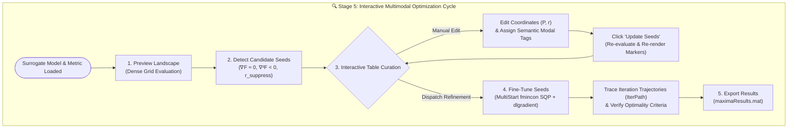

# ☄️ Optimization & Multimodal Seed Curation Workflow Guide

**Framework:** ☄️ ASSTEROID Optimization Engine (🔍 Stage 5)  
**Associated Scripts:** [`scripts/apps/assteroid_app.m`](../scripts/apps/assteroid_app.m), [`scripts/pipeline/run_locate_maxima.m`](../scripts/pipeline/run_locate_maxima.m), [`src/orchestration/runLocalizationWorkflow.m`](../src/orchestration/runLocalizationWorkflow.m)  
**Manuscript Reference:** Supplementary Note 2, Sections S2.1.2 (Stages 4–5) & S2.6 (*Dense Parameter-Space Exploration and Topology-Aware Local Maxima Extraction*)

---

## 1. Overview & Physical Rationale

In high-Q plasmonic arrays such as Nanoparticle-on-Mirror (NPoM) architectures, the optical response exhibits rich multimodal structure across $(P, r)$ parameter space. Distinct electromagnetic mechanisms—including:
- localized particle-film gap cavity modes,
- higher-order multipolar resonances,
- surface lattice resonances (SLRs) arising from in-plane radiative diffraction coupling, and
- Wood's anomaly grazing thresholds—

manifest as separate, isolated local extrema rather than a single monolithic optimum. Standard unconstrained global optimizers inevitably converge to whichever peak happens to have the highest single-objective amplitude, discarding secondary modes that may offer superior optical quality factors, broader operational fabrication tolerances, or reduced ohmic absorption.

To address this, ASSTEROID implements a **topology-aware, multi-stage exploration and refinement workflow**:
1. **Dense Grid Inference:** The deep neural surrogate evaluates metric landscapes across $> 10^6$ coordinates in seconds.
2. **Topology-Aware Peak Extraction:** 8-connected discrete peak detection filters candidates using gradient magnitude thresholds ($\|\nabla F\| \approx 0$) and negative-definite Laplacian concavity ($\nabla^2 F < 0$).
3. **Interactive Seed Curation & Semantic Tagging:** Researchers inspect candidate seeds on 2D contour maps, prune boundary artifacts, adjust coordinates, and assign physical labels (e.g., *Mode I*, *Mode II+*, *SLR Dipole*).
4. **Continuous Constrained Gradient Refinement:** Localized MultiStart sequential quadratic programming (`fmincon` with SQP or Interior-Point) refines seeds using analytical network gradients (`dlgradient`), enforcing physical packing constraints ($r/P \leq 0.49$).
5. **Relational Archiving:** Optimal coordinates, convergence trajectories, and solver diagnostics are permanently recorded in structured relational tables.

---

## 2. Interactive Graphical User Interface Workflows

The optimization canvas in ASSTEROID ([`ASSTEROID.m`](../ASSTEROID.m) / [`start_app.m`](../start_app.m)) provides reactive controls, live parameter verification, and immediate 2D contour feedback.



### Workflow A: Clean Start to Master Export

Use this sequence for standard end-to-end optimization of a trained surrogate model:
1. **Load Surrogate Model:** Ensure a validated ResNet model (`.mat`) and refractive index dispersion file are loaded.
2. **Select Target Metric:** Choose from canonical metrics (`EF_vol`, `EF_surf`, `Absorptance`) and variants (`avg`, `laser`, or `analyte`).
3. **Click `Preview Landscape`:** Generates and plots the dense 2D metric landscape across the specified $(P, r)$ domain.
4. **Click `Detect Seeds`:** Runs discrete topological filtering and populates the seed table with candidate peaks. Seeds appear as circular markers on the landscape.
5. **Click `Fine-Tune Seeds`:** Dispatches localized MultiStart `fmincon` around the active seeds. Converged optima are marked with distinct diamond symbols, and optimization paths are drawn.
6. **Review Solver Outputs:** Inspect optimality criteria, exit flags, and final metric values.
7. **Click `Export Results`:** Exports `maximaResults.mat` containing structured tables to the project workspace.

### Workflow B: Interactive Seed Curation & Manual Editing

When physical intuition or experimental fabrication constraints dictate exploring specific geometries:
1. Generate or detect initial seeds as in Workflow A.
2. **Edit Coordinates Directly:** In the interactive seed table, click on any `Period (P)` or `Radius (r)` cell and enter custom coordinates (in nm).
3. **Assign Semantic Tags:** Edit the `Tag` column with domain-specific labels (e.g., `"Mode II Quadrupole"`, `"SLR Target A"`).
4. **Prune Artifacts:** Uncheck seeds located on numerical boundaries or fabrication-infeasible corners.
5. **Click `Update Seeds`:** Re-evaluates surrogate metrics at the edited coordinates and updates markers on the contour plot.
6. **Click `Fine-Tune Seeds`:** Dispatches localized gradient refinement from the newly defined seed locations. The optimizer preserves all custom semantic tags in the exported results.

### Workflow C: Multi-Metric Landscape Comparison

To evaluate trade-offs between different optical objectives (e.g., comparing localized volume enhancement $\text{EF}_V$ with far-field absorbance $A_L$):
1. Configure and optimize for Metric 1 (e.g., `EF_vol_avg`), exporting results as `optima_EF_vol.mat`.
2. Change the metric dropdown to Metric 2 (e.g., `Absorptance`).
3. **State Management Safeguard:** The application automatically clears stale heatmap data and cached seeds upon metric change to prevent visual ghosting or cross-metric contamination.
4. Click `Preview Landscape` to render the new metric's topology.
5. Detect and refine seeds for Metric 2, exporting to `optima_Absorptance.mat`.

### Workflow D: Model Hot-Reloading

If you retrain the surrogate or swap between different network architectures:
1. Select the new model file in the model selector.
2. The application validates feature preprocessing flags (`FeatureLogTransform`, `IncludeRatios`, material dispersion metadata) against the active configuration.
3. Optimization state buffers are cleanly reset, ensuring that predictions originate strictly from the newly loaded weights.

---

## 3. Standalone Scriptable CLI Workflow

The optimization workflow is fully scriptable for automated headless execution or cluster environments using [`src/orchestration/localizeMaximaConfig.m`](../src/orchestration/localizeMaximaConfig.m) and [`src/orchestration/runLocalizationWorkflow.m`](../src/orchestration/runLocalizationWorkflow.m).

```matlab
% 1. Initialize environment
setup_project;

% 2. Define configuration structure
cfg = localizeMaximaConfig( ...
    WorkDir = pwd, ...
    ModelFile = "models/sers_dnn_model.mat", ...
    RiCsvFile = "src/io/DefaultRefractiveIndices.dat", ...
    Metric = "EF_vol", ...
    MetricVariant = "avg", ...
    PLimits = [500, 1400], ...
    RLimits = [50, 650], ...
    Resolution = 1.0, ...            % nm grid step
    CandidatePercentile = 70, ...    % Upper percentile threshold
    LaplacianThreshold = 0, ...      % Negative concavity requirement
    MaxCandidates = 20, ...          % Maximum seeds to extract
    SuppressionRadius = 15, ...      % Non-max suppression radius in nm
    RefineAlgorithm = "sqp", ...     % "sqp" or "interior-point"
    DiscreteOnly = false, ...        % false = continuous fmincon refinement
    SaveResults = true, ...
    OutputFile = "maximaResults.mat");

% 3. Execute workflow with console progress reporting
reporter = ProgressReporter.console();
results = runLocalizationWorkflow(cfg, reporter);

% 4. Inspect converged local optima
disp(results.maximaResults(:, ["Tag", "period", "radius", "MetricValue", "ExitFlag"]));
```

---

## 4. Optimization Engine Details

### Candidate Peak Extraction Algorithm

A grid point $(P_i, r_j)$ is accepted as an initial candidate seed if and only if it satisfies all of the following conditions:
1. **8-Connected Local Maximum:** $F(P_i, r_j) \geq F(P_{i+\Delta}, r_{j+\Delta})$ for all 8 adjacent neighbors.
2. **Metric Threshold:** $F(P_i, r_j) \geq \text{prctile}(F, \theta_{\text{cand}})$, ensuring exploration focuses on viable high-enhancement basins.
3. **Laplacian Concavity:** $\nabla^2 F(P_i, r_j) < 0$, verifying local peak curvature rather than plateau saddle points.
4. **Physical Packing Feasibility:** $r_j / P_i \leq 0.49$, satisfying the non-overlapping sphere boundary condition.
5. **Non-Maximum Suppression:** For all candidate pairs within distance $d < R_{\text{suppress}}$, only the candidate with the larger objective value is retained.

### Continuous Constrained Refinement (`fmincon`)

Each active seed $(P_0, r_0)$ serves as an initial point for continuous local optimization:
$$\max_{P, r} \quad F(P, r)$$
$$\text{subject to} \quad \frac{r}{P} \leq 0.49, \quad P_{\min} \leq P \leq P_{\max}, \quad r_{\min} \leq r \leq r_{\max}$$

Key solver configurations:
- **Gradient Computation:** Analytical neural graph gradients computed directly via `dlgradient` for machine-precision sensitivity and fast convergence.
- **Algorithm:** Sequential Quadratic Programming (`sqp`) or Interior-Point (`interior-point`).
- **Stopping Criteria:** Step tolerance `1e-6` nm, optimality tolerance `1e-6`, maximum iterations `200`.

---

## 5. Output Data Schema (`maximaResults.mat`)

Exported optimization MAT files contain three permanently archived relational tables:

### 1. `maximaResults` Table
Summary table of converged local maxima:
| Column | Type | Units | Description |
|:---|:---|:---|:---|
| `Tag` | `string` | — | Semantic mode label (*Mode I*, *Mode II+*, etc.) |
| `period` | `double` | nm | Optimized lattice period $P^*$ |
| `radius` | `double` | nm | Optimized nanoparticle radius $r^*$ |
| `diameter` | `double` | nm | Particle diameter $D^* = 2r^*$ |
| `MetricValue` | `double` | — | Predicted objective metric value at $(P^*, r^*)$ |
| `ExitFlag` | `int32` | — | Solver termination flag ($>0$ indicates successful convergence) |
| `Iterations` | `int32` | — | Number of gradient iterations required |
| `FirstOrderOpt` | `double` | — | First-order optimality measure ($\|\nabla L_{\text{Lagrange}}\|_{\infty}$) |

### 2. `allLocalRuns` Table
Detailed record of all individual MultiStart trials, including starting seed coordinates, final objective values, and solver message strings.

### 3. `attemptTrajectories` Table
Contains high-resolution iteration coordinate histories (`IterPath`) documenting the step-by-step optimization path of each solver trajectory through $(P, r)$ space. These trajectories are directly visualizable on the 2D contour canvas.

---

## 6. Defensive Architecture & Troubleshooting

| Symptom | Probable Cause | Built-in Resolution / Recommended Action |
|:---|:---|:---|
| `"No seeds selected"` | Table checkboxes are empty | Check at least one seed row in the table before clicking *Fine-Tune Seeds*. |
| `"Invalid coordinates skipped"` | Non-numeric or NaN entries entered manually | Table parser automatically discards non-finite values and logs a console warning. |
| Stale markers visible after metric switch | Cross-metric cache contamination | Automatically resolved: switching metrics triggers `resetOptimizeState(optimize, false)` to purge cached previews. |
| Optimizer converges to boundary ($r/P = 0.49$) | Peak lies outside physical packing threshold | Normal physical behavior for configurations where enhancement increases monotonically with particle density. Inspect boundary behavior in Stage 6. |
| Plot fails to update after table edit | Seeds updated in memory only | Click **Update Seeds** explicitly to trigger canvas redraw. |
| Slow MultiStart refinement | Dense candidate count on CPU | Reduce `MaxCandidates` or leverage the Parallel Computing Toolbox (`UseParallel = true`). |
