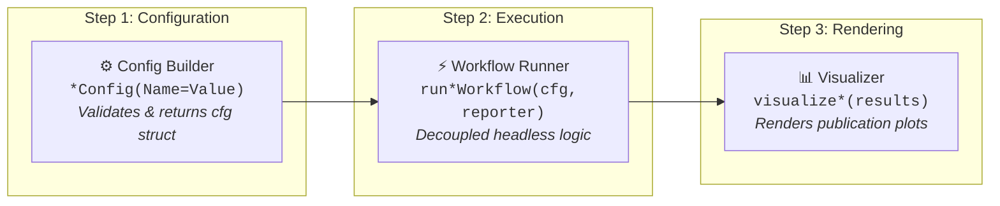

# ☄️ ASSTEROID Orchestration Layer & Workflow Patterns

**Last Updated:** February 11, 2026  
**Scope:** Unified config → workflow → visualization pattern  
**Audience:** Developers extending pipelines, adding new workflows

---

## Overview: The Three-Step Pattern

Every major workflow in ☄️ ASSTEROID follows this unified pattern:



### Benefits of This Pattern

✅ **Consistency** - Same structure across all workflows
✅ **Testability** - Config can be saved, results replayed
✅ **Reusability** - Same workflow called from CLI & app
✅ **Progress Reporting** - Unified ProgressReporter interface
✅ **Error Handling** - Centralized exception management

---

## Orchestration Files

**Location:** `src/orchestration/`

### Core Infrastructure

1. **`ProgressReporter.m`** - Unified progress interface
2. **`computeDenseGridParams.m`** - Shared grid generation
3. **`loadAndValidateModel.m`** - Shared model/RI loading
4. **`loadOrGeneratePredictions.m`** - Shared prediction caching

### Workflow Suite

| Stage | Workflow | Config Builder / Engine | Workflow Function / Controller | Visualizer |
|:---:|---|---|---|---|
| 💾 Stage 0 | Master Database Management | `DatabaseEngine(workDir)` | `DatabaseController` / `DatabaseEngine` | `database_tab.html` Tree Inspector |
| 📥 Stage 1 | Ingestion & Sweep QA | `importSweepConfig` | `runImportSweepWorkflow` / `ImportController` | `visualizeImportSummary` |
| 🎯 Stage 2 | Adaptive Sampling | `adaptiveSamplingConfig` | `runAdaptiveSamplingWorkflow` / `SamplingController` | 2D Density & Curvature Overlay |
| 🧠 Stage 3 | DNN Training | `trainingConfig` | `runTrainingWorkflow` / `TrainingController` | Real-time Loss & Validation Curves |
| 🔮 Stage 4 | Prediction & Landscape | `predictionVisConfig` | `runPredictionVisWorkflow` / `PredictionController` | Sub-nm Metric Contour Maps |
| 🔍 Stage 5 | Maxima Localization | `localizeMaximaConfig` | `runLocalizationWorkflow` / `OptimizeController` | `visualizeMaximaResults` / Trajectories |
| 🌌 Stage 6 | Multi-Dimensional Vis & Export | `session.visState` | `VisualizeController` | 1D Spectra, 2D Maps, 3D `viewer3d` |

---

## Example: Prediction Workflow

### Step 1: Config Builder

**File:** `src/orchestration/predictionVisConfig.m`, lines 1-80

```matlab
function cfg = predictionVisConfig(options)
    arguments
        %% Paths
        options.WorkDir (1,1) string = pwd
        options.ModelFile (1,1) string = ""
        options.RiCsvFile (1,1) string = ""
        options.PredictionFile (1,1) string = ""
        
        %% Grid
        options.LambdaLaser (1,1) double = 785
        options.PLimits (1,2) double = [750, 950]
        options.RLimits (1,2) double = [50, 450]
        options.StokesShiftLimits (1,2) double = [100, 3600]
        options.Resolution (1,1) double = 0.75
        options.StokesShiftResolution (1,1) double = 2
        
        %% Metrics
        options.Metrics (1,:) string = ["Absorptance", "EF_vol", "EF_surf"]
        
        %% Control
        options.RecomputePredictions (1,1) logical = false
        options.UseAnalyteWeighting (1,1) logical = true
        options.AnalyteRamanSpectrumFile (1,1) string = "AnalyteSpectrum.dat"
        
        %% Export
        options.ExportPredictions (1,1) logical = true
        options.ExportGraphics (1,1) logical = true
        options.ExportVideo (1,1) logical = false
    end
    
    % Validate and compute derived quantities
    grid = computeDenseGridParams( ...
        LambdaLaser=options.LambdaLaser, ...
        PLimits=options.PLimits, ...
        RLimits=options.RLimits, ...
        StokesShiftLimits=options.StokesShiftLimits, ...
        Resolution=options.Resolution, ...
        StokesShiftResolution=options.StokesShiftResolution, ...
        OutputUnit="um");
    
    % Assemble config
    cfg = struct();
    cfg.workDir = options.WorkDir;
    cfg.modelFile = options.ModelFile;
    cfg.riCsvFile = options.RiCsvFile;
    cfg.predictionFile = options.PredictionFile;
    cfg.pSamples = grid.pSamples;
    cfg.rSamples = grid.rSamples;
    cfg.lambdaSamples = grid.lambdaSamples;
    cfg.lambdaLaser = options.LambdaLaser;
    cfg.stokesShiftLimits = options.StokesShiftLimits;
    cfg.metrics = options.Metrics;
    cfg.recomputePredictions = options.RecomputePredictions;
    cfg.analyteRamanSpectrumFile = options.AnalyteRamanSpectrumFile;
    cfg.exportPredictions = options.ExportPredictions;
    cfg.exportGraphics = options.ExportGraphics;
end
```

**Key Features:**
- Arguments block for validation
- Derived quantities computed (grid, paths)
- All parameters in one struct with meaningful names
- Can be saved to disk and replayed

### Step 2: Workflow Execution

**File:** `src/orchestration/runPredictionVisWorkflow.m`, lines 1-100

```matlab
function results = runPredictionVisWorkflow(cfg, reporter)
    arguments
        cfg (1,1) struct
        reporter = ProgressReporter.silent()
    end
    
    totalTimer = tic;
    
    % Working directory
    if cfg.workDir ~= "" && cfg.workDir ~= string(pwd)
        cd(cfg.workDir);
    end
    
    %% ~1. Load model & RI
    reporter.start("LoadModel");
    try
        [model, ri] = loadAndValidateModel(...
            ModelFile=cfg.modelFile, ...
            RiCsvFile=cfg.riCsvFile, ...
            Reporter=reporter);
        reporter.complete("LoadModel", "Model and RI loaded.");
    catch ME
        reporter.fail("LoadModel", ME.message);
        rethrow(ME);
    end
    
    %% 2. Load analyte spectrum (optional)
    analyteSpectrum = struct();
    if cfg.useAnalyteWeighting && isfile(cfg.analyteRamanSpectrumFile)
        reporter.start("LoadAnalyte");
        try
            analyteSpectrum = loadAndNormalizeAnalyteSpectrum(...
                cfg.analyteRamanSpectrumFile);
            reporter.complete("LoadAnalyte", "Analyte spectrum loaded.");
        catch ME
            reporter.warn("LoadAnalyte", ME.message);
        end
    end
    
    %% 3. Generate or load predictions
    reporter.start("Predictions");
    try
        allData = loadOrGeneratePredictions(...
            Recompute=cfg.recomputePredictions, ...
            PredictionFile=cfg.predictionFile, ...
            Model=model, Ri=ri, ...
            PSamples=cfg.pSamples, ...
            RSamples=cfg.rSamples, ...
            LambdaSamples=cfg.lambdaSamples, ...
            LambdaLaser=cfg.lambdaLaser, ...
            StokesShiftLimits=cfg.stokesShiftLimits, ...
            AnalyteSpectrum=analyteSpectrum, ...
            InterpResolution=cfg.stokesShiftResolution, ...
            SaveAfterGeneration=cfg.exportPredictions, ...
            Reporter=reporter);
        reporter.complete("Predictions", ...
            sprintf("Ready: %d geometries, %d wavelengths.", ...
            size(allData.lambda, 1), size(allData.lambda, 2)));
    catch ME
        reporter.fail("Predictions", ME.message);
        rethrow(ME);
    end
    
    %% 4. Visualize metrics
    numMetrics = numel(cfg.metrics);
    figures = cell(numMetrics, 1);
    
    for mIdx = 1:numMetrics
        metricName = cfg.metrics(mIdx);
        metricField = char(matlab.lang.makeValidName(metricName));
        
        stepName = sprintf("Vis_%s", char(metricName));
        reporter.start(stepName);
        
        if ~isfield(allData, metricField)
            reporter.warn(stepName, sprintf("Field %s missing.", metricField));
            continue;
        end
        
        % Reshape and visualize
        [metricVolume, pGrid_nm, rGrid_nm, lambdaGrid_nm] = ...
            reshapeSoAToVolume(allData, metricField);
        
        figures{mIdx} = visualizeMetric(metricVolume, pGrid_nm, rGrid_nm, ...
            lambdaGrid_nm, metricName, cfg);
        
        reporter.complete(stepName, sprintf("%s visualised.", char(metricName)));
    end
    
    %% Assemble results
    results = struct();
    results.allData = allData;
    results.model = model;
    results.ri = ri;
    results.cfg = cfg;
    results.figures = figures;
    results.elapsedTotal = toc(totalTimer);
    
    reporter.info(sprintf("Workflow completed in %.1f s.", results.elapsedTotal));
end
```

**Key Features:**
- Clear step organization with comments
- Try-catch around each major section
- Progress reporting at each stage
- Config consumed directly (no redundant params)
- Results contain all outputs + metadata

### Step 3: Visualization (Optional)

```matlab
function visualizeMetric(metricVolume, pGrid, rGrid, lambdaGrid, ...
    metricName, cfg)
    
    figLaser = figure('Name', sprintf('%s @ Laser', metricName));
    colormap('gray');
    
    [~, laserIdx] = min(abs(lambdaGrid - cfg.lambdaLaser));
    laserSlice = metricVolume(:, :, laserIdx);
    
    pcolor(pGrid, rGrid, laserSlice);
    shading interp;
    colorbar;
    xlabel('Period (nm)');
    ylabel('Radius (nm)');
    title(sprintf('%s @ λ = %.1f nm', metricName, cfg.lambdaLaser));
    
    if cfg.exportGraphics
        exportgraphics(figLaser, ...
            fullfile(cfg.workDir, sprintf('%s_laser.pdf', metricName)));
    end
end
```

---

## ProgressReporter: Unified Status Interface

**Location:** `src/orchestration/ProgressReporter.m`

### Three Operating Modes

```matlab
% Silent - no output
reporter = ProgressReporter.silent();

% Console - stdout logging
reporter = ProgressReporter.console();

% Callback - custom handler (app UI)
reporter = ProgressReporter.fromCallback(@handleAppProgress);
```

### Usage in Workflows

```matlab
function runExampleWorkflow(cfg, reporter)
    % Step 1: Do something
    reporter.start("Step1");
    result1 = expensiveComputation();
    reporter.complete("Step1", "First step done");
    
    % Step 2: Do something with potential error
    reporter.start("Step2");
    try
        result2 = risky_operation();
        reporter.complete("Step2", "Second step done");
    catch ME
        reporter.fail("Step2", ME.message);
        rethrow(ME);
    end
    
    % Status message (not tied to step)
    reporter.info(sprintf("Completed in %.1f s", toc));
end
```

### Output Examples

**Console:**
```
[Step1] Started.
[Step1] First step done. (2.3s)
[Step2] Started.
[Step2] Second step done. (5.1s)
Completed in 7.4 s.
```

**App Callback:**
```matlab
function handleAppProgress(eventType, stepName, data)
    % eventType: "start", "complete", "fail", "warn", "info"
    % stepName: e.g., "LoadModel", "Predictions"
    % data.message, data.fraction, data.elapsed
    
    if strcmp(eventType, 'complete')
        sendEventToHTMLSource(src, 'ProgressUpdate', data);
    end
end
```

---

## Adding a New Workflow

### Template

```matlab
%% 1. Config Builder
function cfg = myNewWorkflowConfig(options)
    arguments
        % Define all parameters with validation
        options.WorkDir (1,1) string = pwd
        options.SomeParam (1,1) double {mustBePositive} = 100
        % ...
    end
    
    cfg = struct();
    cfg.workDir = options.WorkDir;
    cfg.someParam = options.SomeParam;
    % Compute derived quantities
end

%% 2. Workflow
function results = runMyNewWorkflow(cfg, reporter)
    arguments
        cfg (1,1) struct
        reporter = ProgressReporter.silent()
    end
    
    total_timer = tic();
    
    %% Step 1
    reporter.start("Step1");
    try
        output1 = doSomething(cfg);
        reporter.complete("Step1", "Done");
    catch ME
        reporter.fail("Step1", ME.message);
        rethrow(ME);
    end
    
    %% Step 2
    reporter.start("Step2");
    try
        output2 = doMore(output1, cfg);
        reporter.complete("Step2", "Done");
    catch ME
        reporter.fail("Step2", ME.message);
        rethrow(ME);
    end
    
    %% Results
    results = struct();
    results.output1 = output1;
    results.output2 = output2;
    results.elapsed = toc(total_timer);
    
    reporter.info(sprintf("Workflow done in %.1f s", results.elapsed));
end

%% 3. Visualizer (optional)
function visualizeMyNewWorkflow(results)
    figure;
    plot(results.output1);
    title('My New Workflow Results');
    xlabel('X');
    ylabel('Y');
end

%% 4. CLI Entry Point
% scripts/pipeline/run_my_new_workflow.m
setup_project;
cfg = myNewWorkflowConfig( ...
    WorkDir=pwd, ...
    SomeParam=500);
reporter = ProgressReporter.console();
results = runMyNewWorkflow(cfg, reporter);
visualizeMyNewWorkflow(results);
```

---

## Shared Utilities

### 1. computeDenseGridParams()

**Purpose:** Generate (p, r, λ) grid vectors  
**Used by:** Prediction, Optimization, Adaptive Sampling

```matlab
grid = computeDenseGridParams( ...
    LambdaLaser=785, ...           % nm
    PLimits=[750, 950], ...        % nm
    RLimits=[50, 450], ...         % nm
    StokesShiftLimits=[100, 3600], ...  % cm^-1
    Resolution=0.75, ...            % nm
    StokesShiftResolution=2, ...     % cm^-1
    OutputUnit="um");                % output in micrometers

% Returns:
% grid.pSamples      [1 × NP] in micrometers
% grid.rSamples      [1 × NR] in micrometers
% grid.lambdaArray_um [1 × NL] in micrometers
% grid.raman_shifts   structure with Stokes/anti-Stokes info
```

### 2. loadAndValidateModel()

**Purpose:** Unified model + RI loading  
**Used by:** Prediction, Optimization, App

```matlab
[model, ri] = loadAndValidateModel(...
    ModelFile="model.mat", ...
    RiCsvFile="McPeak.csv", ...
    WavelengthUnit="um", ...
    Reporter=reporter);

% model: struct with net, normalize, denormalize, flags
% ri: struct with nFunc, kFunc (interpolants)
```

### 3. loadOrGeneratePredictions()

**Purpose:** Cache management for dense predictions  
**Used by:** Prediction & Optimization (shared results)

```matlab
allData = loadOrGeneratePredictions(...
    Recompute=false, ...                    % Load cached if available
    PredictionFile="predictions.mat", ...
    Model=model, Ri=ri, ...
    PSamples=p_um, RSamples=r_um, ...
    LambdaSamples=lambda_um, ...
    LambdaLaser=785, ...
    Reporter=reporter);

% Returns: SoA struct ready for visualization
```

---

## Integration with App

### How App Uses Workflows

**Location:** `scripts/apps/run_sers_app.m`

```matlab
%% Training Tab
function handleTrainEvent(src, event, fig)
    % Build config from HTML form
    cfg = trainingConfig( ...
        DataDirectory=event.Data.dataFile, ...
        MaxEpochs=event.Data.maxEpochs, ...
        LearnRateSchedule=event.Data.learnRateSchedule);
    
    % Create progress reporter that sends to UI
    reporter = ProgressReporter.fromCallback(...
        @(type, step, data) sendEventToHTMLSource(src, 'Progress', data));
    
    % Run workflow
    results = runTrainingWorkflow(cfg, reporter);
    
    % Emit results to UI
    sendEventToHTMLSource(src, "TrainingComplete", struct( ...
        "rmseTest", results.testMetrics.rmse, ...
        "modelFile", results.savedPath));
end

%% Prediction Tab
function generateVisPredictions(src, data, fig)
    state = fig.UserData.visState;
    
    cfg = predictionVisConfig( ...
        WorkDir=pwd, ...
        ModelFile=state.modelFile, ...
        PLimits=state.pLimits, ...
        RLimits=state.rLimits);
    
    reporter = ProgressReporter.fromCallback(...
        @(type, step, data) updateUIProgress(src, data));
    
    results = runPredictionVisWorkflow(cfg, reporter);
    
    % Update visualization panel
    visualizeTabResults(results, visPanel);
end

%% Optimization Tab
function runOptimizePipeline(src, d, fig, visPanel)
    state = fig.UserData.visState;
    
    cfg = localizeMaximaConfig(...
        Model=state.model, ...
        Ri=state.ri, ...
        NumLocalMaxima=d.numLocalMaxima);
    
    reporter = ProgressReporter.fromCallback(...
        @(type, step, data) updateUIProgress(src, data));
    
    results = runLocalizationWorkflow(cfg, reporter);
    visualizeMaximaResults(results, ParentAxes=visPanel);
end
```

---

## Error Handling Pattern

### Pyramid of Error Handling

```
Level 1: Config builder validates arguments
         └─ Catches invalid parameter types

Level 2: Workflow catches major steps
         └─ Reports via ProgressReporter.fail()
         └─ Re-throws for handling at higher level

Level 3: App catches workflow execution
         └─ Converts to user-friendly message
         └─ Sends to UI via event

Level 4: HTML UI displays error toast
         └─ User sees clear error message
```

### Example

```matlab
% Level 3: App
try
    results = runPredictionVisWorkflow(cfg, reporter);
catch ME
    % Convert technical error to user message
    userMsg = sprintf('Prediction failed:\n%s', ME.message);
    sendEventToHTMLSource(src, 'Error', struct("message", userMsg));
end

% Level 4: HTML
matlab.internal.addEventListener('Error', function(event) {
    showToast(event.Data.message, 'error');  // Red error toast
});
```

---

## Conventions

### File Naming

```
*Config.m           →  Configuration builder
run*Workflow.m      →  Workflow orchestrator
visualize*.m        →  Visualization function
```

### Function Signatures

```matlab
% Config builder
function cfg = myWorkflowConfig(options)
    arguments  % Validation block
        options.param1 type {validator} = default
    end
end

% Workflow
function results = runMyWorkflow(cfg, reporter)
    arguments
        cfg (1,1) struct
        reporter = ProgressReporter.silent()
    end
end

% Visualizer
function visualizeMyResults(results)
    % No fixed signature - domain specific
end
```

### Struct Field Conventions

```
Config:
  .workDir         - working directory
  .input_file      - input file path
  .output_file     - output file path
  .param1, .param2 - domain parameters

Results:
  .output1         - primary result
  .output2         - secondary result
  .cfg             - config used
  .elapsed         - wall-clock time
```

---

## Performance Considerations

### Caching Strategy

Prediction results are cached to avoid recomputation:

```matlab
% Check if predictions already exist
if isfile(predFile) && ~recompute
    loaded = load(predFile, 'allData');
    allData = loaded.allData;
else
    % Generate new predictions
    allData = predict_dense_spectrum(...);
    save(predFile, 'allData');
end
```

### Batching

Large grids processed in chunks:

```matlab
chunkSize = 200000;  % geometry × wavelength pairs

while startIdx <= numRows
    stopIdx = min(startIdx + chunkSize - 1, numRows);
    batch = features(startIdx:stopIdx, :);
    
    batchPred = minibatchpredict(model.net, batch);
    preds(startIdx:stopIdx, :) = batchPred;
    
    startIdx = stopIdx + 1;
end
```

### Timing

Each workflow reports elapsed time:

```matlab
results.elapsedTotal = toc(totalTimer);  % Saved in results

reporter.info(sprintf('Workflow done in %.1f s', results.elapsedTotal));
```

---

**Orchestration Version:** 1.0  
**Last Updated:** February 11, 2026  
**Status:** Production-ready, fully tested

